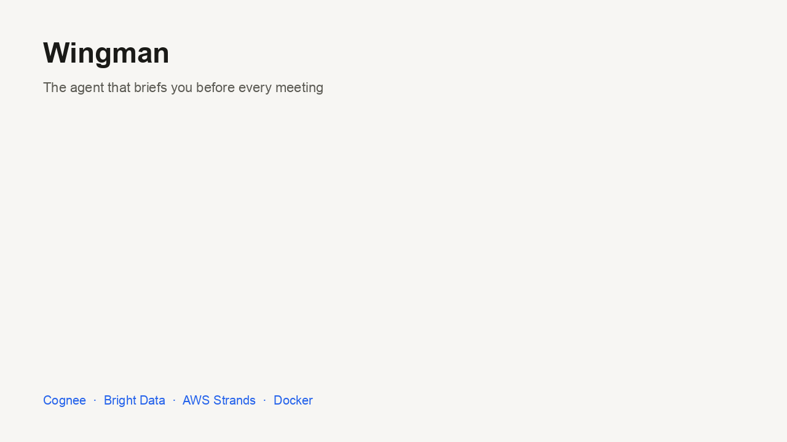
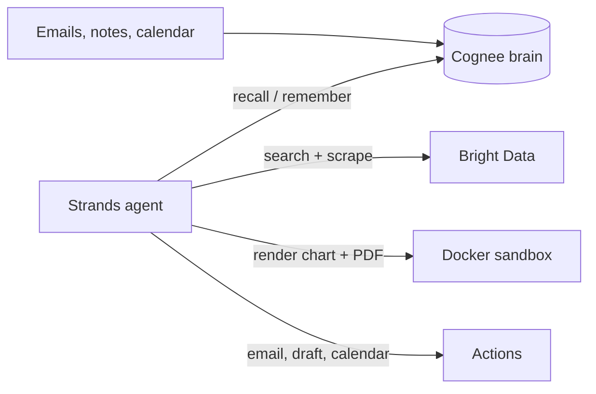

# 🧠 Wingman

**The personal agent that briefs you before every meeting.**

Wingman reads your calendar, recalls everything you know about the people you're meeting from your own emails and notes, checks the live web for what has changed in their world, and hands you a one-page dossier — then emails it to you and drafts your follow-up.

Built for **Battle of the Personal Brains** (Bright Data office, San Francisco — 2026-09-21).



*A slideshow, not a screen recording — but every number on it is real: the live `wingman doctor` output, and an answer from Cognee Cloud that joins three separate documents to say what was promised and whether it shipped.*

---

## What it does

- Finds your next external meeting from your calendar.
- Recalls your history with each attendee from a **Cognee** knowledge graph.
- Surfaces open commitments in both directions ("you owe them" and "they owe you").
- Pulls fresh public facts about the person and their company through **Bright Data**.
- Flags **stale memories** — things your notes say that the web now contradicts.
- Renders a PDF dossier with an interaction timeline inside a **Docker** sandbox.
- Emails you the dossier and drafts a follow-up message.
- Writes what it learned back into the brain.

## The stack

- **Cognee** — long-term graph memory (the Personal Brain).
- **Bright Data** — live web search and scraping via its MCP server.
- **AWS Strands Agents** — the agent loop, plus memory injection, hooks and steering.
- **Docker** — isolated, network-less execution of generated rendering code.
- **FastAPI + Next.js** — a dashboard that streams the agent's reasoning live.
- **Your data** — a local folder of exported emails, notes, and a calendar file.

## Three Strands patterns doing real work

- **Memory injection** — the Cognee brain is registered as a Strands memory store, so relevant memories are recalled and placed in the prompt **before every model call**. The agent does not have to remember to look.
- **Audit hook** — deterministic code after every tool call. One line on screen for demo narration, one JSON line in `out/run_<timestamp>.jsonl`.
- **Steering** — Python rules checked **before** a tool runs, with no LLM involved:
  - At most 3 web searches and 3 page reads per run, which caps Bright Data spend.
  - Every search must name the attendee or their company, which stops wrong-person results.
  - A follow-up draft may only be addressed to the attendee.

- These patterns are adapted from AWS's [Agent with a Brain](https://github.com/sandhya-subramani/Agent-with-a-Brain) starter (MIT-0).

## How it fits together



## Documentation

- **[Quickstart](docs/QUICKSTART.md) — start here. Keys, checks, first run.**
- [Product document](docs/PRODUCT.md) — problem, users, scope, demo script, risks.
- [Technical document](docs/TECHNICAL.md) — architecture, components, data contract, build plan.
- [Examples and demo guide](docs/DEMO.md) — worked examples with real output, real-data setup, demo run sheet.
- [Pitch](docs/PITCH.md) — the one-minute speech, the 90-second demo run sheet, and a slide-by-slide outline of the deck.

---

## Prerequisites

- Python 3.10 – 3.14
- [uv](https://docs.astral.sh/uv/) for environment management
- Docker Desktop (running)
- Node.js 18+ (only if you run the Bright Data MCP server locally with `npx`)
- Accounts and keys:
  - Cognee Cloud tenant URL and API key
  - Bright Data API token
  - An LLM: a Gemini API key (free, no card), an Anthropic API key, or Amazon Bedrock access
  - A Gmail app password (for emailing the dossier to yourself)

## Setup

1. Enter the project.

```bash
cd ~/Desktop/wingman
```

2. Install dependencies (Python 3.12 is fetched automatically).

```bash
uv sync
```

3. Create your secrets file, then fill it in.

```bash
cp .env.example .env
```

4. Live-check every dependency. Aim for six `PASS` rows.

```bash
uv run wingman doctor
```

- The sandbox image builds itself on first use.

## The dashboard

```bash
uv run wingman web
```

- Opens on http://localhost:8000.
- **Two pages:** the workspace (meetings, dossier, live agent trace) and `/setup` (health checks with the exact variables each one needs).
- **The agent narrates itself** over Server-Sent Events: what it recalled, every tool call with timings, and anything the steering policy blocked.
- **The UI is pre-built and committed**, so running Wingman needs no Node at all.
- It binds to localhost because it has no login — it can read your mail and spend your API credits.

### Changing the frontend

```bash
cd frontend && npm install && npm run dev
```

- Next.js dev server on :3000, talking to the API on :8000 (start it with `WINGMAN_DEV=1 uv run wingman web`).
- `npm run build` produces a static export and copies it into the Python package.

## Usage

1. Build the brain from the sample data.

```bash
uv run wingman ingest data/sample
```

2. Ask the brain a question directly.

```bash
uv run wingman ask "What did I promise Priya Shah?"
```

3. Generate, render and send a dossier for your next meeting.

```bash
uv run wingman brief --next
```

4. Brief on any person without a calendar entry.

```bash
uv run wingman brief --person "Priya Shah" --company "Cognee"
```

5. Render an existing dossier offline (no keys needed).

```bash
uv run wingman render examples/sample_dossier.json
```

- **All commands:**
  - `web` — run the dashboard.
  - `refresh-sample` — move the sample calendar to tomorrow (run before any demo).
  - `doctor` — live-check every dependency.
  - `ingest <folder>` — remember `.md`, `.txt` and `.eml` files.
  - `ingest-gmail "<gmail search>"` — remember live Gmail messages (read-only IMAP); add `--dry-run` to preview.
  - `ask "<question>"` — query the brain.
  - `graph` — write `out/brain_graph.html`.
  - `meetings` — list upcoming meetings with external attendees.
  - `brief` — the full run.
  - `render <dossier.json>` — sandbox render plus email only.
  - `reset` — wipe the brain's dataset.
- **Output lands in `out/`:**
  - `dossier_<person>.pdf`
  - `dossier_<person>.md`
  - `dossier_<person>.json`
  - `followup_<person>.md`
  - `dossier_<person>.eml` (only when SMTP is not configured)

### Surviving free-tier quotas

- Set **as many model keys as you have**; they form a fallback chain, best free tier first.
- When one hits its daily cap mid-run, Wingman moves to the next instead of failing.
- **Groq is the most generous** (~1,000 requests/day, no credit card) versus Gemini's ~20 — set `GROQ_API_KEY` and it leads the chain.
- `wingman doctor` names which model answered and how many fallbacks are left.
- Bright Data results cache to disk for 12 hours, so rehearsing costs no credits and no waiting.

### Real-time data

- **Web:** always live, through Bright Data search and scrape.
- **Calendar:** set `WINGMAN_CALENDAR` to your Google Calendar secret iCal URL.
- **Email:** `wingman ingest-gmail` reads live Gmail with an app password.
- Step-by-step instructions are in the [demo guide](docs/DEMO.md#going-from-sample-data-to-your-real-data).

## Project layout

```text
wingman/
├── README.md
├── .env.example
├── docs/                 # quickstart, product, technical, demo and pitch documents
├── data/
│   ├── sample/           # safe, fake demo data
│   └── private/          # your real exports (git-ignored)
├── sandbox/              # Dockerfile + render template
├── frontend/             # Next.js dashboard (source; the build is committed to the package)
├── examples/             # a sample dossier for the offline render
├── src/wingman/          # agent, plugins, brain, ingest, gmail, calendar, sandbox, actions, doctor, cli
├── tests/                # offline test suite
└── out/                  # generated dossiers (git-ignored)
```

## Tests

```bash
uv run pytest -q
```

- Runs offline; no API keys needed.
- Covers calendar parsing, email ingestion, the dossier schema, email guardrails, the memory store, the audit hook, every steering rule, sandbox rendering and isolation, the whole `brief` pipeline with the agent mocked, and every dashboard API scenario: streaming, concurrency, agent failure, path-traversal attempts and secret leakage.
- The Docker tests skip themselves when the daemon is not running.

## Privacy and safety

- Real personal data stays in `data/private/` and is never committed.
- Demos run on `data/sample/` only.
- Generated code runs in a container with no network and a single mounted temp directory.
- Wingman only ever emails **you**. Messages to anyone else are saved as drafts.
- Web pages and email bodies are treated as untrusted data, never as instructions.
- Only public, professional information is collected about other people.

## Status

- [x] Product, technical and demo documents
- [x] Fictional sample data set
- [x] Brain wrapper and ingestion (folder, `.eml`, live Gmail)
- [x] Calendar reader (local file or live iCal feed)
- [x] Strands agent with memory, web and drafting tools
- [x] Docker sandbox renderer — tested, isolation verified
- [x] Actions: email to self, follow-up draft, write-back
- [x] `wingman doctor` live checks
- [x] Strands memory injection, audit hook and steering policy
- [x] Web dashboard: FastAPI + Next.js, live agent streaming, verified in a browser
- [x] Provider fallback chain — a model hitting its daily cap no longer ends the run
- [x] Bright Data disk cache — rehearsing a demo costs no credits and no waiting
- [x] Bright Data MCP wiring verified (server boots, 5 tools listed, call reaches the API)
- [x] Full `brief` pipeline verified end to end with the agent mocked
- [x] Test suite: `uv run pytest -q` (55 tests, offline)
- [x] Gemini provider: a no-credit-card path to a working brief
- [x] Full live run on real services — brain recall, web search, steering cap, PDF, follow-up draft
- [x] Pitch deck, one-minute speech and demo run sheet ([docs/PITCH.md](docs/PITCH.md))
- [ ] Demo rehearsal

## License

MIT. See [LICENSE](LICENSE).

- The memory, hook and steering patterns are adapted from AWS's [Agent with a Brain](https://github.com/sandhya-subramani/Agent-with-a-Brain), which is MIT-0 and requires no attribution. Credited here anyway.

## Acknowledgements

- [Cognee](https://www.cognee.ai/)
- [Bright Data](https://brightdata.com/)
- [Strands Agents](https://strandsagents.com/)
- [Docker](https://www.docker.com/)
- [Agent with a Brain](https://github.com/sandhya-subramani/Agent-with-a-Brain) — the AWS starter whose memory, hook and steering patterns Wingman adapts.
