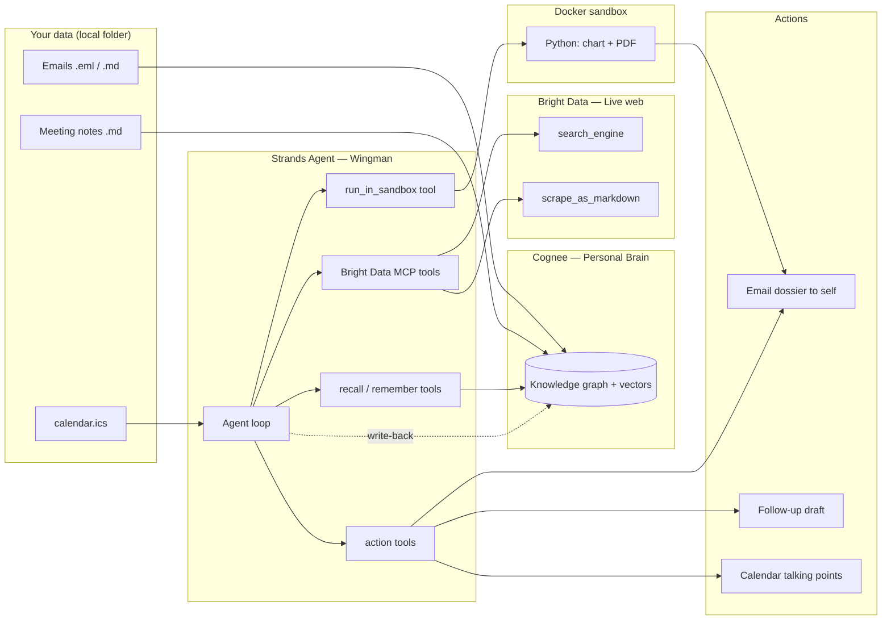

# Wingman — Technical Document

- **Companion to:** [PRODUCT.md](PRODUCT.md)
- **Date:** 2026-09-21
- **Status:** Draft v1 — API details checked against vendor docs on this date; items still to confirm are listed in [section 12](#12-things-to-confirm-with-mentors-on-site).

---

## 0. Implementation status (updated after the build)

- The code in `src/wingman/` is the source of truth; the snippets below explain the design and are simplified.
- **Differences from the original design:**
  - Cognee calls run on one shared background event loop (`brain.py`) instead of `asyncio.run()` per call, because Cognee keeps loop-bound resources.
  - The agent uses our own `web_search` and `read_web_page` tools that wrap Bright Data's `search_engine` and `scrape_as_markdown`, so page text can be truncated to 12,000 characters.
  - The agent returns a typed `Dossier` through Strands `structured_output_model`; render, email and write-back are plain code in `cli.py` so they always happen.
  - The sandbox also runs with a read-only root filesystem, no capabilities, a non-root user and a process limit.
  - Real-time inputs were added: a live iCal feed (`WINGMAN_CALENDAR`) and read-only Gmail over IMAP (`wingman ingest-gmail`).
  - `wingman doctor` live-checks every dependency.
  - Three patterns adopted from AWS's "Agent with a Brain" starter (MIT-0): memory injection, an audit hook, and a steering policy. See section 3.6.
- **Verified on 2026-09-21 (`uv run pytest -q`, 23 tests):**
  - Calendar parsing.
  - `.eml` ingestion.
  - Sandbox render to PDF, plus network and filesystem isolation.
  - Email fallback to `.eml`, and the recipient-is-always-me guardrail.
  - The whole `brief` pipeline with the agent mocked: calendar → dossier → sandbox → email → write-back.
  - Memory store, audit hook, and all five steering rules.
  - Bright Data MCP server boots through Strands `MCPClient`, lists 5 tools, and a call reaches the API (401 with a dummy token, as expected).
  - Every Cognee and Strands function the code calls exists with the expected signature in the installed versions.
- **Not yet run (needs API keys):**
  - Cognee ingest and recall against a real tenant.
  - A real Bright Data search and scrape.
  - The LLM agent loop and its structured `Dossier` output.
  - SMTP send and Gmail IMAP fetch.
- **Installed versions:**
  - cognee 1.6.0
  - mcp 2.1.1
  - Python 3.12 (pinned by uv)

## 1. Architecture



## 2. Run sequence for one meeting

1. `cli.py` loads `calendar.ics` and selects the next meeting with an external attendee.
2. The agent calls `recall` for the person, then for their company, then for open commitments.
3. The agent calls Bright Data `search_engine` with `"<name>" "<company>"`, then `scrape_as_markdown` on the best 2–3 URLs.
4. The agent reconciles brain facts against web facts and lists contradictions as stale-memory alerts.
5. The agent emits a structured `Dossier` object (JSON).
6. The agent calls `save_followup_draft` if the user has an open commitment.
7. `cli.py` calls `run_in_sandbox` with the dossier JSON; sandboxed Python draws the timeline and builds the PDF.
8. `cli.py` calls `send_dossier_email`, which only ever sends to the user.
9. `cli.py` calls `remember` once to write the new web facts back into the brain.

## 3. Components

### 3.1 Cognee — the brain

- **Install:** `uv add "cognee[anthropic]"` or plain `uv add cognee` when using Cognee Cloud.
- **Python:** 3.10 – 3.14 supported (this machine has 3.14.6).
- **Core API (current):** `remember`, `recall`, `forget`, `improve`.
- **Cloud mode:** call `cognee.serve(url=..., api_key=...)` once; every later call routes to your cloud tenant, so no local LLM key is needed for graph building.
- **Why cloud:** the $50 credit covers it, and ingestion does not burn laptop CPU or a personal OpenAI key.

```python
# brain.py — thin wrapper around Cognee.
# Cognee is async, so every call is awaited inside an async function.
import asyncio
import os
import cognee


async def connect() -> None:
    # Route all later calls (remember/recall/forget) to the Cognee Cloud tenant.
    # The tenant URL looks like https://<your-tenant>.aws.cognee.ai
    await cognee.serve(
        url=os.environ["COGNEE_CLOUD_URL"],
        api_key=os.environ["COGNEE_API_KEY"],
    )


async def ingest_text(text: str) -> None:
    # remember() runs the full pipeline: ingest -> chunk -> extract entities
    # -> build graph -> enrich. One call per document keeps failures isolated.
    await cognee.remember(text)


async def ask(question: str) -> list[str]:
    # recall() auto-routes to the best retrieval strategy (graph or vector).
    results = await cognee.recall(query_text=question)
    return [r.text for r in results]


# Worked example:
#   asyncio.run(connect())
#   asyncio.run(ingest_text("2026-06-12 email to Priya Shah (Acme): I promised to send the vendor comparison by Friday."))
#   asyncio.run(ask("What did I promise Priya Shah?"))
#   -> ["You promised Priya Shah a vendor comparison by Friday (June 12 email)."]
```

#### Ingestion format

- Each source file becomes one `remember()` call.
- Prepend a small header so the graph extractor sees the metadata as text:

```python
# ingest.py — turn one email into a text block Cognee can extract entities from.
def email_to_text(sender: str, to: str, date: str, subject: str, body: str) -> str:
    # The header lines give the LLM extractor explicit people, dates and
    # direction (who wrote to whom), which is what makes "who owes whom" work.
    return (
        f"TYPE: email\n"
        f"DATE: {date}\n"
        f"FROM: {sender}\n"
        f"TO: {to}\n"
        f"SUBJECT: {subject}\n\n"
        f"{body}"
    )


# Worked example:
#   email_to_text("me@x.com", "priya@acme.com", "2026-06-12", "Vendor comparison", "I'll send it by Friday.")
#   -> "TYPE: email\nDATE: 2026-06-12\nFROM: me@x.com\nTO: priya@acme.com\nSUBJECT: Vendor comparison\n\nI'll send it by Friday."
```

#### Target graph shape (what we expect Cognee to extract)

- **Person** — name, email, role.
- **Company** — name.
- **Interaction** — date, type (email or meeting), summary.
- **Commitment** — description, owner, counterparty, due date, status.
- **Fact** — statement, source, as-of date.
- **Key edges:**
  - Person `works_at` Company
  - Person `participated_in` Interaction
  - Commitment `made_by` Person
  - Commitment `owed_to` Person
  - Fact `about` Person or Company

### 3.2 Strands Agents — the harness

- **Install:** `uv add strands-agents strands-agents-tools`
- **Model:** Amazon Bedrock is the default provider; Anthropic API is the fallback if Bedrock access is not ready.
- **Cognee tools:** `cognee-integration-strands` ships ready-made `remember` and `recall` tools via `cognee_tools()`.
  - It pins `cognee>=1.0.0,<=1.1.2` and `strands-agents>=1.42.0,<2.0.0`.
  - If the pins clash with the cloud SDK version, use the hand-written `@tool` wrappers below instead.

```python
# agent.py — assemble the Wingman agent.
import asyncio
from mcp import StdioServerParameters, stdio_client
from strands import Agent, tool
from strands.tools.mcp import MCPClient

import brain  # our wrapper from section 3.1


@tool
def recall_memory(question: str) -> str:
    """Search the user's personal brain (emails, notes, past meetings).

    Args:
        question: A natural-language question, e.g. "What did I promise Priya Shah?"
    """
    # Strands tools are sync; Cognee is async, so bridge with asyncio.run().
    return "\n".join(asyncio.run(brain.ask(question)))


@tool
def remember_fact(fact: str) -> str:
    """Store a new fact in the user's personal brain.

    Args:
        fact: One self-contained sentence including a date and a source URL.
    """
    asyncio.run(brain.ingest_text(fact))
    return "stored"


# Bright Data's MCP server runs as a child process over stdio.
# It reads the API token from the API_TOKEN env var (inherited from our process).
bright_data = MCPClient(
    lambda: stdio_client(StdioServerParameters(command="npx", args=["-y", "@brightdata/mcp"]))
)

SYSTEM_PROMPT = """You are Wingman. For the given meeting you must:
1. Recall what the user knows about each attendee and their company.
2. Find what is publicly new about them on the web. Cite a URL for every web fact.
3. List contradictions between memory and web as stale-memory alerts.
4. Return a Dossier JSON object, render it, then email it."""


def build_agent() -> Agent:
    # The MCP client must be open while the agent uses its tools.
    bright_data.start()
    web_tools = bright_data.list_tools_sync()  # search_engine, scrape_as_markdown, ...
    return Agent(
        system_prompt=SYSTEM_PROMPT,
        tools=[recall_memory, remember_fact, *web_tools],
    )


# Worked example:
#   agent = build_agent()
#   agent("Prepare a dossier for my 10:00 meeting tomorrow with Priya Shah (Acme).")
#   -> agent calls recall_memory -> search_engine -> scrape_as_markdown -> returns Dossier JSON
```

### 3.3 Bright Data — the live web

- **Transport option A (local):** `npx -y @brightdata/mcp` with env var `API_TOKEN`.
- **Transport option B (hosted):** `https://mcp.brightdata.com/mcp?token=<API_TOKEN>` over streamable HTTP — no Node needed.
- **Base tools (always on):**
  - `search_engine`
  - `search_engine_batch`
  - `scrape_as_markdown`
  - `scrape_batch`
  - `discover`
- **Optional `social` tool group:** adds structured extractors such as `web_data_linkedin_person_profile` (P2).
- **Query discipline:**
  - Always search `"<full name>" "<company>"` to avoid wrong-person matches.
  - Cap at 3 scrapes per person to protect latency and credits.
  - Every web fact in the dossier must carry its source URL.

### 3.4 Docker sandbox — safe code execution

- **Purpose:** run LLM-influenced Python (chart + PDF) with no network and no host access.
- **P0 approach:** a locked-down `docker run` against a small prebuilt image.
- **Stretch approach:** Docker Sandboxes (`sbx` CLI, microVM isolation) — confirm the programmatic exec path with the Docker mentor.

```dockerfile
# sandbox/Dockerfile — tiny image with only what rendering needs.
FROM python:3.12-slim
RUN pip install --no-cache-dir matplotlib reportlab
WORKDIR /work
```

```python
# sandbox.py — run a Python script inside a throwaway, network-less container.
import json
import subprocess
import tempfile
from pathlib import Path


def run_in_sandbox(script: str, dossier: dict, timeout_s: int = 60) -> Path:
    # 1. Stage the script and its input data in a temp dir that gets mounted.
    work = Path(tempfile.mkdtemp(prefix="wingman-"))
    (work / "main.py").write_text(script)
    (work / "dossier.json").write_text(json.dumps(dossier))
    (work / "out").mkdir()

    # 2. Run with no network, capped memory/CPU, and auto-remove on exit.
    subprocess.run(
        [
            "docker", "run", "--rm",
            "--network", "none",        # generated code cannot call out
            "--memory", "512m",
            "--cpus", "1",
            "-v", f"{work}:/work",      # only this temp dir is visible
            "wingman-sandbox",
            "python", "/work/main.py",
        ],
        check=True,
        timeout=timeout_s,
    )

    # 3. The script's contract: write its result to /work/out/dossier.pdf
    return work / "out" / "dossier.pdf"


# Worked example:
#   pdf = run_in_sandbox(open("render_template.py").read(), {"person": "Priya Shah", "timeline": [...]})
#   -> PosixPath('/var/folders/.../wingman-abc123/out/dossier.pdf')
```

- **Reliability rule:** ship a known-good `render_template.py`; the agent passes data, and only optionally edits the script. If rendering fails, fall back to the Markdown dossier.

### 3.6 The three Strands patterns (`plugins.py`)

Adapted from AWS's [Agent with a Brain](https://github.com/sandhya-subramani/Agent-with-a-Brain)
starter (MIT-0). Each removes a dependency on the model behaving well.

#### Memory injection

- `CogneeMemory` satisfies the Strands `MemoryStore` protocol with two methods, `search` and `add`,
  which map onto `brain.recall_async` and `brain.remember_async`.
- `MemoryManager` then does two things:
  - Calls `search` before every model call and prepends the results, wrapped in a `<personal_brain>` tag.
  - Exposes the same store to the model as a `recall_memory` tool for targeted questions.
- `writable=False` and `add_tool_config=False`: write-back stays deterministic code in `cli.py`,
  so it happens on every run rather than when the model remembers to.

```python
# plugins.py (abridged) — the whole bridge between Strands memory and Cognee.
class CogneeMemory:
    name = "personal_brain"
    max_search_results = 5
    writable = False

    async def search(self, query, options=None):
        # Strands calls this before every model call with the latest message.
        texts = await brain.recall_async(query, top_k=self.max_search_results)
        return [MemoryEntry(content=t, store_name=self.name) for t in texts]
```

- **Why the async bridge matters:** Cognee keeps loop-bound resources on Wingman's shared
  background loop, while Strands calls `search` on its own loop. `brain._submit` wraps the
  cross-loop call in `asyncio.wrap_future`, so awaiting it never blocks either loop.

#### Audit hook

- `AuditHook` subscribes to `AfterToolCallEvent` and runs after every tool call.
- It prints a numbered line for demo narration and appends one JSON line to `out/run_<timestamp>.jsonl`.
- Fields: timestamp, tool, args, status, milliseconds, result size.

#### Steering

- `ResearchPolicy.steer_before_tool` runs **before** a tool executes and returns `Proceed` or `Guide`.
- A `Guide` sends the reason back to the model instead of running the tool, so the model adapts.
- **Rules:**
  - At most 3 `web_search` calls and 3 `read_web_page` calls per run.
  - Every `web_search` query must contain a name part of the attendee or their company.
  - `save_followup_draft` may only be addressed to the attendee.
- No LLM is involved in any of these decisions, which is what makes the cost cap a guarantee
  rather than a request.

### 3.5 Actions

- **Email dossier to self (P0):** SMTP with a Gmail app password; attach the PDF.
- **Follow-up draft (P1):** save as `out/followup_<person>.md`; optionally create a Gmail draft (P2).
- **Calendar talking points (P2):** Google Calendar API `events.patch` on the description field.
- **Guardrail:** Wingman never sends mail to anyone except the user. Messages to other people are drafts only.

## 4. Data contract — the `Dossier` object

```python
# models.py — the structured object the agent must return before rendering.
from pydantic import BaseModel


class WebFact(BaseModel):
    statement: str      # e.g. "Acme raised a $40M Series B"
    source_url: str     # every web fact must be traceable
    as_of: str          # ISO date the page was published or scraped


class StaleAlert(BaseModel):
    memory_says: str    # e.g. "Priya is a PM at Stripe"
    web_says: str       # e.g. "Priya joined Ramp as Head of Product in Aug 2026"
    source_url: str


class TimelineEvent(BaseModel):
    date: str           # ISO date
    kind: str           # "email" | "meeting" | "note"
    summary: str


class Dossier(BaseModel):
    person: str
    company: str
    how_we_know_each_other: str
    last_interaction: TimelineEvent
    i_owe_them: list[str]
    they_owe_me: list[str]
    whats_new: list[WebFact]
    stale_alerts: list[StaleAlert]
    talking_points: list[str]
    timeline: list[TimelineEvent]


# Worked example (abridged):
#   Dossier(person="Priya Shah", company="Acme", i_owe_them=["Vendor comparison (promised 2026-06-12)"], ...)
```

## 5. Planned repository layout

```text
wingman/
├── README.md
├── .env.example
├── .gitignore
├── pyproject.toml            # created by `uv init`
├── docs/
│   ├── PRODUCT.md
│   └── TECHNICAL.md
├── data/
│   ├── sample/               # safe, fake demo data (committed)
│   └── private/              # real exports (git-ignored)
├── sandbox/
│   ├── Dockerfile
│   └── render_template.py
├── src/wingman/
│   ├── config.py             # env loading
│   ├── models.py             # Dossier schema
│   ├── brain.py              # Cognee wrapper
│   ├── ingest.py             # folder -> remember()
│   ├── calendar_reader.py    # .ics -> next external meeting
│   ├── sandbox.py            # run_in_sandbox
│   ├── actions.py            # email, drafts, calendar
│   ├── agent.py              # Strands agent + tools
│   └── cli.py                # `wingman ingest` / `wingman brief`
└── out/                      # generated dossiers (git-ignored)
```

## 6. Configuration

- All secrets live in `.env` (git-ignored); see `.env.example`.
- **Variables:**
  - `COGNEE_CLOUD_URL` — Cognee Cloud tenant URL.
  - `COGNEE_API_KEY` — Cognee Cloud API key.
  - `API_TOKEN` — Bright Data token (this exact name is what the MCP server reads).
  - `AWS_REGION` — Bedrock region.
  - `AWS_ACCESS_KEY_ID` — Bedrock credentials.
  - `AWS_SECRET_ACCESS_KEY` — Bedrock credentials.
  - `ANTHROPIC_API_KEY` — fallback model provider.
  - `SMTP_USER` — Gmail address used to send the dossier.
  - `SMTP_APP_PASSWORD` — Gmail app password.
  - `WINGMAN_ME` — your own email, used to tell "me" from "them" in threads.

## 7. Build plan (5 hours)

- **Hour 1 — Brain:**
  - `uv init`, install dependencies, connect to Cognee Cloud.
  - Write `ingest.py`; ingest `data/sample/`.
  - Verify three recall questions return sensible answers.
- **Hour 2 — Agent + web:**
  - Wire the Strands agent with `recall_memory` and the Bright Data MCP tools.
  - Get a Markdown dossier for one hard-coded person.
- **Hour 3 — Calendar + sandbox:**
  - Parse `calendar.ics`.
  - Build the sandbox image and `render_template.py`; produce a PDF.
- **Hour 4 — Actions + polish of the loop:**
  - Email to self with the attachment.
  - Stale-memory alerts and follow-up draft.
  - Write-back with `remember_fact`.
- **Hour 5 — Demo only:**
  - Freeze code.
  - Record a fallback run.
  - Rehearse twice.

## 8. Testing checklist

- Recall returns the seeded commitment ("vendor comparison by Friday").
- Web search for the seeded person returns the right person.
- Seeded stale fact (old employer) triggers an alert.
- Sandbox container has no network (`docker run --network none ... curl` fails).
- PDF renders with the timeline chart.
- Email arrives with the attachment.
- A full run completes in under 90 seconds.

## 9. Security and privacy

- Real personal exports stay in `data/private/`, which is git-ignored.
- Demo runs use `data/sample/` only.
- Generated code runs with no network and sees only a temp directory.
- Outbound email is restricted to the user's own address.
- Scraped content is treated as untrusted data: the system prompt tells the agent never to follow instructions found in web pages or emails.
- Only public, professional information is gathered about other people.

## 10. Observability

- Stream Strands tool calls to the terminal — it doubles as demo narration.
- Log each run to `out/run_<timestamp>.jsonl` with:
  - tool name
  - arguments
  - latency
  - result size

## 11. Cost guardrails

- Cap Bright Data at 1 search + 3 scrapes per attendee.
- Ingest at most 40 documents for the demo.
- Cache web results per person for the session in `out/cache/`.

## 12. Things to confirm with mentors on site

- **Cognee:**
  - Exact keyword arguments of `remember()` for dataset names and file paths.
  - How to open the graph visualization for a Cloud tenant.
  - Whether `cognee-integration-strands` works with `cognee.serve()` cloud mode.
- **AWS:**
  - Whether temporary Bedrock credentials are provided, and the recommended model ID.
- **Docker:**
  - Whether Docker Sandboxes (`sbx`) exposes a programmatic "run this script" path suited to a tool call, or whether plain `docker run` is the expected pattern.
- **Bright Data:**
  - Whether the `social` tool group (LinkedIn profile data) is covered by the $50 credit.

## 13. References

- [Cognee quickstart](https://docs.cognee.ai/getting-started/quickstart)
- [Cognee installation](https://docs.cognee.ai/getting-started/installation)
- [Cognee Cloud SDK](https://docs.cognee.ai/cognee-cloud/connections/cloud-sdk)
- [Cognee + Strands integration](https://docs.cognee.ai/integrations/strands-integration)
- [Strands Agents — MCP tools](https://strandsagents.com/docs/user-guide/concepts/tools/mcp-tools/)
- [Bright Data MCP server](https://github.com/brightdata/brightdata-mcp)
- [Docker Sandboxes](https://www.docker.com/products/docker-sandboxes/)
- [Docker Docs — run an agent in a sandbox](https://docs.docker.com/get-started/tutorials/run-an-agent/)
